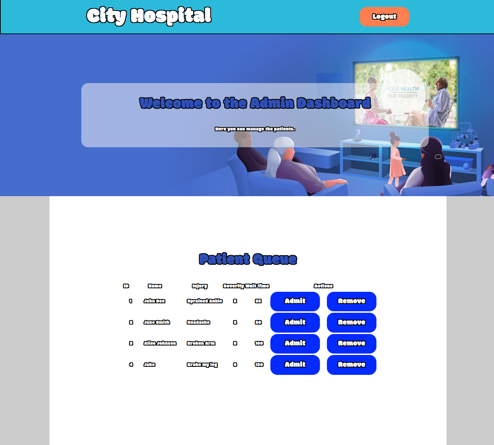

# ER waiting 

Name: Muhammad Haris & Ahmed Omar\
Student #: 300157052 & 300267489\
[GitHub](https://github.com/mharis337/ER_Waiting_Room) \
[Design System](/docs/design_system.md)\
[Portfolio](https://github.com/mharis337/Portfolio)

## Description
This project is a web application designed to manage the waiting room experience in an Emergency Room (ER).The application aims to streamline the process, improve patient satisfaction, and optimize the workflow for medical staff.

## Installation
1. Clone the repository:
    ```bash
    git clone https://github.com/mharis337/ER_Waiting_Room.git
    ```
2. Navigate into the project directory:
    ```bash
    cd ER_Waiting_Room/
    ```
3. Start the application:
    ```bash
    ./start
    ```
## Patient View
1. **Main Screen:**
    - The main screen displays the "City Hospital" title and options to "Check Wait Time" or "Admin Login".
    - Click on "Enter Queue" to join the waiting list.

    

2. **Enter Queue:**
    - Fill in your Name, Injury Description, and Severity of Pain (1-10) using the provided form.
    - Click "Submit" to join the queue.
    - A notification will display your queue code and estimated wait time.

    
    

3. **Check Wait Time:**
    - To check your wait time, enter your Name and 3-Digit Code received when you joined the queue.
    - Click "Check" to see your estimated wait time.

    
    


## Admin View

1. **Admin Login:**
    - Click on "Admin Login" on the main screen.
    - Enter your Username (admin) and Password (password) to access the admin dashboard.

    

2. **Admin Dashboard:**
    - The admin dashboard allows you to manage the patient queue.
    - You can view patient details, including their ID, Name, Injury Description, Severity, and Wait Time.
    - Use the "Admit" or "Remove" buttons to manage the patients.

    


## UI States

### Main Screen


### Enter Queue


### Queue Notification


### Check Wait Time


### Wait Time Check Notification


### Admin Login


### Admin Dashboard

